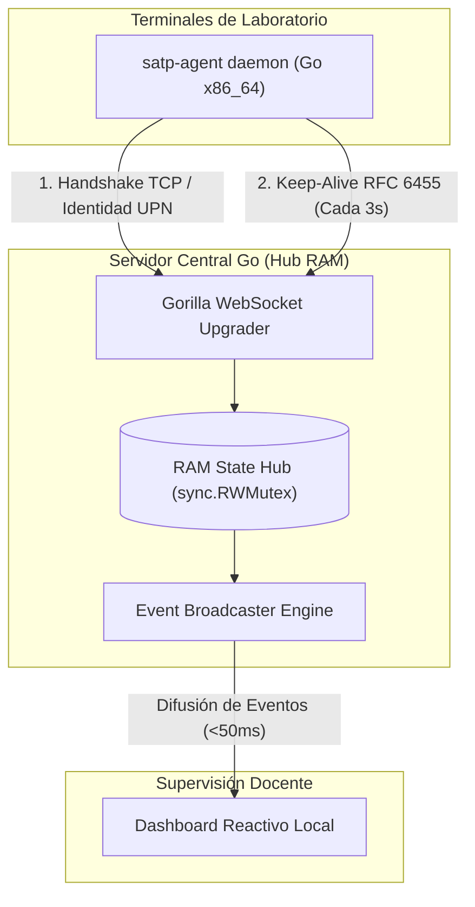

# SATP-Lab: Sistema Ciberfísico de Telemetría y Certificación de Trabajo Activo en Laboratorios

> [!NOTE]
> **Resumen Ejecutivo:**  
> Plataforma distribuida de telemetría de red y auditoría continua diseñada para la **certificación determinística de presencia y trabajo efectivo** en estaciones de cómputo universitarias. Sustituye los esquemas analógicos de firmas en papel y formularios web por un modelo autónomo de bajo nivel desarrollado en **Go 1.22+** y sustentado en el protocolo **WebSockets (RFC 6455)**, garantizando consumo de ancho de banda insignificante y respuesta sub-milisegundo ante eventos del kernel del sistema operativo.

> [!IMPORTANT]
> **Ficha Técnica Institucional:**
> - **Institución:** Universidad Católica de Santa María (UCSM)
> - **Facultad:** Facultad de Ciencias e Ingenierías Físicas y Formales
> - **Escuela Profesional:** Ingeniería de Sistemas (EPIS)
> - **Asignatura:** Computación en Red III — Sección B
> - **Semestre Académico:** 2026
> - **Docente Evaluador:** `jangulo@ucsm.edu.pe`
> - **Equipo de Desarrollo:**
>   - Chipana Flores, Alexander Tomas
>   - Kana Zambrano, Luz Clarita
>   - Montenegro Gonzales, Orlando Jose

---

## 1. Arquitectura del Motor de Telemetría (Fase 1: Núcleo en RAM)

El núcleo desacopla la recepción masiva de sockets de los motores de persistencia en disco: el servidor gestiona el estado volátil en un concentrador central con exclusión mutua (`sync.RWMutex`) en memoria RAM y difunde eventos reactivos hacia el navegador del docente en menos de 50 milisegundos.



### Especificación de Mecanismos Internos

- **Multiplexación No Bloqueante:** Cada socket entrante es atendido por una *goroutine* ligera cuyo stack inicial ocupa apenas **2 KB**, permitiendo soportar cientos de estaciones simultáneas con un consumo total de RAM inferior a **15 MB**.
- **Control de Concurrencia Seguro:** La lectura y actualización del estado de las terminales se sincroniza mediante bloqueos de granularidad fina (`Lock` para altas/bajas de conexión y `RLock` para lecturas de difusión masiva), erradicando condiciones de carrera (*Race Conditions*).
- **Desacoplamiento Transaccional:** La telemetría en tiempo real no ejecuta escrituras directas sobre bases de datos relacionales durante la clase práctica, eliminando cuellos de botella por contención de I/O en disco.

---

## 2. Auditoría Forense de Red y Métricas Empíricas

> [!TIP]
> **Inspección en Capa de Transporte y Enlace:**  
> El comportamiento del enlace fue verificado a nivel de paquetes mediante `tcpdump` y Wireshark en la interfaz loopback IPv6 (`::1`), auditando las banderas TCP y los códigos de operación (opcodes) nativos de la RFC 6455:

| Parámetro Evaluado | Especificación Teórica | Medición Real en Cable | Método de Verificación |
| :--- | :--- | :--- | :--- |
| **Establecimiento TCP** | < 100 ms | **53 µs** | 3-Way Handshake (`[S]`, `[S.]`, `[.]`) |
| **Negociación L7** | HTTP Upgrade a RFC 6455 | **129 bytes** | `HTTP/1.1 101 Switching Protocols` |
| **Trama Ping (Keep-Alive)** | < 50 bytes | **21 bytes** | Opcode `0x09` (`0x89 13` + UnixNano) |
| **Trama Pong (Heartbeat)** | < 50 bytes | **25 bytes** | Opcode `0x0A` (`0x8a 93` + 4B Client Mask) |
| **Ancho de Banda Continuo** | < 1.0 KB/s | **≈ 0.023 KB/s** | 46 bytes transmitidos cada 3 segundos |
| **Latencia RTT Promedio** | < 15 ms | **0.32 ms - 0.51 ms** | Timestamp en nanosegundos embebido |
| **Detección de Desconexión** | < 200 ms | **< 50 ms** | Ruptura de socket (`TCP FIN` / `SIGTERM`) |

### Cómputo Formal de Ancho de Banda Sostenido

$$\text{Rendimiento de Red} = \frac{21\text{ bytes (Ping)} + 25\text{ bytes (Pong)}}{3\text{ segundos}} = 15.33\text{ B/s} \approx \mathbf{0.015\text{ KB/s}}$$

En una sesión práctica ininterrumpida de dos horas académicas (7,200 segundos), una estación de trabajo transfiere un acumulado de:

$$\text{Tráfico Total} = 7200\text{ s} \times 15.33\text{ B/s} \approx \mathbf{110.37\text{ KB}}$$

Este volumen es despreciable frente al tráfico de red convencional del campus, garantizando que el sistema no sature los switches ni los puntos de acceso Wi-Fi.

---

## 3. Desglose del Protocolo y Anatomía de Tramas

### A. Handshake de Conexión Inicial (JSON Payload)
Al establecerse el canal, el agente cliente envía de forma obligatoria una trama de texto estructurada para su registro en el hub:
```json
{
  "device_id": "LAB-EPIS-PC14",
  "upn": "estudiante@ucsm.edu.pe"
}
```

### B. Tramas de Control RFC 6455 a Nivel Hexadecimal
- **Frame de Ping (Servidor $\rightarrow$ Agente):**
  - Byte `0x89`: Bandera FIN activada (`1000`) + Opcode `0x9` (Ping Frame).
  - Byte `0x13`: Longitud de carga útil (19 bytes correspondientes al timestamp UNIX en nanosegundos).
- **Frame de Pong (Agente $\rightarrow$ Servidor):**
  - Byte `0x8A`: Bandera FIN activada (`1000`) + Opcode `0xA` (Pong Frame).
  - Byte `0x93`: Bandera Mask activada (`1`) + Longitud de carga útil (19 bytes).
  - 4 Bytes siguientes: Clave de enmascaramiento pseudoaleatoria generada por el cliente.

---

## 4. Estructura del Repositorio

```text
xx_STAP-Lab/
├── agent/                      # Demonio de telemetría en Go (Multiplataforma)
│   ├── go.mod                  # Declaración del módulo satp-agent
│   ├── go.sum                  # Sumas criptográficas de dependencias
│   ├── main.go                 # Lógica de extracción de identidad y bucle Pong
│   └── satp-agent.exe          # Binario monolítico para Windows 11 (amd64)
├── backend/                    # Servidor concentrador de alta concurrencia
│   ├── go.mod                  # Declaración del módulo satp-backend
│   ├── go.sum                  # Dependencias del servidor
│   └── main.go                 # Hub en RAM, WebSockets y Dashboard embebido
├── database/                   # Modelado relacional (Esquema en reserva)
│   └── init.sql                # DDL para usuarios, sesiones y auditoría
├── docker-compose.yml          # Infraestructura aislada de pruebas (PostgreSQL/Redis)
├── .gitignore                  # Filtro estricto de binarios, credenciales y temporales
└── README.md                   # Documentación técnica principal del proyecto
```

---

## 5. Guía de Puesta en Marcha y Validación Local

### Paso 1: Inicialización del Servidor Concentrador
En una terminal principal, inicie el concentrador de sockets:
```bash
cd backend
go run main.go
```

**Salida esperada en consola:**
```text
2026/10/05 10:35:46 [SERVIDOR GO] SATP-Lab Telemetry Core iniciado en :8000
2026/10/05 10:35:46 [INFO] Abre http://localhost:8000/dashboard en tu navegador
```

Abra el navegador en `http://localhost:8000/dashboard`. La interfaz reactiva cargará en estado de espera sin estaciones conectadas.

---

### Paso 2: Ejecución del Agente en Linux (Kali / Ubuntu)
En una segunda terminal, ejecute el cliente local:
```bash
cd agent
go run .
```

**Salida esperada en consola:**
```text
2026/10/05 10:35:54 [AGENTE] Conectando a ws://localhost:8000/ws/agent...
2026/10/05 10:35:54 [CONECTADO] Identidad: usuario@ucsm.edu.pe en host-local
```

En el dashboard del navegador, la estación se creará instantáneamente y pasará a color **VERDE (ONLINE)**.

---

### Paso 3: Compilación Cruzada para Windows 11 Pro (VMware)
Compile el binario estático optimizado para el entorno cliente final sin requerir herramientas de desarrollo en la máquina virtual:
```bash
cd agent
GOOS=windows GOARCH=amd64 go build -ldflags="-s -w" -o satp-agent.exe .
```

> [!NOTE]
> Los modificadores `-ldflags="-s -w"` eliminan la tabla de símbolos y la información de depuración DWARF, reduciendo el peso final del ejecutable a menos de **8 MB**.

Copie el archivo `satp-agent.exe` a la máquina virtual con Windows 11 y ejecútelo desde PowerShell o CMD indicando la IP de su host:
```powershell
.\satp-agent.exe -server=192.168.1.XX:8000
```

---

## 6. Comprobación y Monitoreo de Tráfico con Kali Linux

Para auditar en tiempo real el paso de las tramas de control WebSocket y medir la respuesta del kernel:
```bash
sudo tcpdump -i lo -nn -XX "tcp port 8000"
```

Para filtrar exclusivamente las conexiones que contengan datos (omitiendo paquetes ACK puros):
```bash
sudo tcpdump -i lo -nn -A "tcp port 8000 and (((ip[2:2] - ((ip[0]&0xf)<<2)) - ((tcp[12:1]&0xf0)>>2)) != 0)"
```

---

## 7. Criterio de Resiliencia y Detección de Desconexión

> [!WARNING]
> **Certificación Determinística de Permanencia:**  
> Ante un cierre de sesión (`Logoff`), apagado de máquina (`Shutdown`) o interrupción abrupta de proceso (`Ctrl + C`), el kernel del sistema operativo emite inmediatamente un paquete de terminación `TCP FIN` o `TCP RST`.  
> 
> El servidor en Go atrapa la rotura del descriptor de archivo mediante el canal `done` en menos de **50 milisegundos**, marcando la terminal en **ROJO (OFFLINE)** y congelando el acumulador de tiempo activo para evitar que un alumno ausente alcance el umbral mínimo del **75%** requerido para acreditar la práctica.
