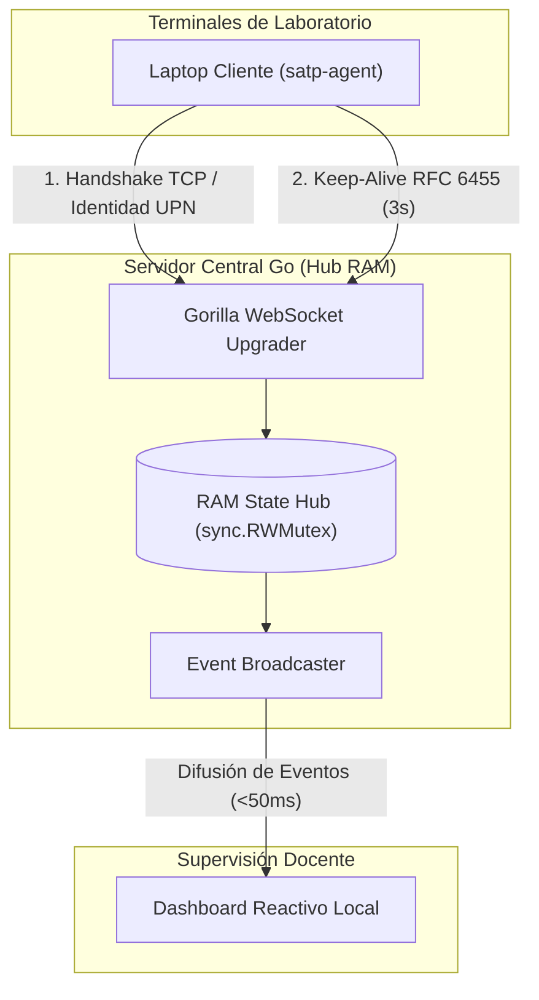

# SATP-Lab: Sistema Ciberfísico de Telemetría y Certificación de Trabajo Activo en Laboratorios

> [!NOTE]
> **Resumen Ejecutivo:**  
> Plataforma distribuida de telemetría de red y auditoría continua orientada a la **certificación determinística de presencia y trabajo efectivo** en estaciones de laboratorio universitario[cite: 21]. Sustituye los esquemas convencionales de pase de lista y formularios web por un modelo de bajo nivel en **Go** y sockets persistentes (**RFC 6455**)[cite: 21], garantizando latencia sub-milisegundo y cero sobrecarga de red[cite: 20].

> [!IMPORTANT]
> **Ficha Técnica y Metadatos Institucionales:**
> - **Institución:** Universidad Católica de Santa María (UCSM)[cite: 16]
> - **Facultad:** Facultad de Ciencias e Ingenierías Físicas y Formales
> - **Escuela:** Escuela Profesional de Ingeniería de Sistemas (EPIS)[cite: 16]
> - **Asignatura:** Computación en Red III — Sección B[cite: 16]
> - **Docente Evaluador:** `jangulo@ucsm.edu.pe`
> - **Equipo Desarrollador:**
>   - Chipana Flores, Alexander Tomas[cite: 16]
>   - Kana Zambrano, Luz Clarita[cite: 16]
>   - Montenegro Gonzales, Orlando Jose[cite: 16]
> - **Nivel de Madurez Tecnológica:** TRL 4 (Componentes validados en maqueta de red)

---

## 1. Arquitectura de Telemetría (Fase 1: Núcleo en RAM)

El núcleo desacopla la recepción de sockets del almacenamiento en disco: el servidor gestiona el estado volátil en un concentrador central con exclusión mutua (`sync.RWMutex`) en memoria RAM y difunde eventos reactivos al navegador en menos de 50 ms.



---

## 2. Auditoría Forense de Red y Métricas Empíricas

> [!TIP]
> **Validación en Capa de Transporte:**  
> Inspección realizada con `tcpdump` en Kali Linux sobre la interfaz loopback IPv6 (`::1`), validando la sobrecarga mínima y la precisión temporal del protocolo[cite: 20]:

| Parámetro Evaluado | Especificación Teórica | Medición Real en Cable | Método de Verificación |
| :--- | :--- | :--- | :--- |
| **Establecimiento TCP** | < 100 ms | **53 µs** | 3-Way Handshake (`[S]`, `[S.]`, `[.]`)[cite: 20] |
| **Negociación L7** | HTTP Upgrade a RFC 6455 | **129 bytes** | `HTTP/1.1 101 Switching Protocols`[cite: 20] |
| **Trama Ping (Keep-Alive)** | < 50 bytes | **21 bytes** | Opcode `0x09` + UnixNano Payload[cite: 12, 20] |
| **Trama Pong (Heartbeat)** | < 50 bytes | **25 bytes** | Opcode `0x0A` + 4B Client Mask[cite: 12, 20] |
| **Ancho de Banda Continuo** | < 1.0 KB/s | **≈ 0.023 KB/s** | 46 bytes transmitidos cada 3 segundos[cite: 20] |
| **Latencia RTT Promedio** | < 15 ms | **0.32 ms - 0.51 ms** | Timestamp embebido en trama de control[cite: 20] |
| **Detección de Desconexión** | < 200 ms | **< 50 ms** | Cierre de socket (`TCP FIN` / `SIGTERM`)[cite: 20] |

> [!NOTE]
> **Cálculo de Consumo de Ancho de Banda:**  
> $$\text{Ancho de Banda} = \frac{21\text{ B (Ping)} + 25\text{ B (Pong)}}{3\text{ s}} = 15.33\text{ B/s} \approx 0.015\text{ KB/s}$$  
> En una sesión práctica continua de dos horas académicas, cada estación consume únicamente **~110 KB** de transferencia total, lo cual representa un impacto despreciable sobre la red del laboratorio.

---

## 3. Estructura del Repositorio

```text
xx_STAP-Lab/
├── agent/                      # Demonio cliente en Go (Multiplataforma)
│   ├── go.mod                  # Módulo satp-agent
│   ├── go.sum                  # Checksums de dependencias
│   ├── main.go                 # Telemetría de bajo nivel y bucle Pong
│   └── satp-agent.exe          # Binario compilado para Windows 11 (amd64)
├── backend/                    # Servidor concentrador de alta concurrencia
│   ├── go.mod                  # Módulo satp-backend
│   ├── go.sum                  # Dependencias del servidor
│   └── main.go                 # Hub en RAM, WebSockets y Dashboard embebido
├── database/                   # Persistencia relacional (En espera de validación)
│   └── init.sql                # DDL para usuarios, sesiones y padrón
├── docker-compose.yml          # Infraestructura aislada (PostgreSQL/Redis)
├── .gitignore                  # Exclusión de binarios, temporales y credenciales
└── README.md                   # Documentación técnica principal
```

---

## 4. Guía de Ejecución y Pruebas Locales

### Paso 1: Puesta en Marcha del Backend
En una terminal principal, inicie el concentrador de telemetría:
```bash
cd backend
go run main.go
```
* **Endpoint de Telemetría:** `ws://localhost:8000/ws/agent`
* **Dashboard Reactivo:** `http://localhost:8000/dashboard`

---

### Paso 2: Conexión del Agente Local
En una segunda terminal, ejecute el agente cliente en Linux:
```bash
cd agent
go run .
```
* **Comportamiento esperado:** La consola del servidor registrará la conexión inmediata y el panel web cambiará el estado de la estación a **VERDE (ONLINE)** en tiempo real.

---

### Paso 3: Compilación Cruzada para Windows 11 (VMware / Laptops)
Genere el binario autónomo para las estaciones destino sin requerir instalación de entornos adicionales en Windows:
```bash
cd agent
GOOS=windows GOARCH=amd64 go build -ldflags="-s -w" -o satp-agent.exe .
```
Copie `satp-agent.exe` a la máquina virtual con Windows 11 en VMware y ejecútelo desde PowerShell o CMD:
```powershell
.\satp-agent.exe -server=192.168.1.XX:8000
```

---

## 5. Auditoría de Tráfico en Vivo (Kali Linux)

Para validar la captura de tramas de control WebSocket y verificar el flujo continuo en Capa 4:
```bash
sudo tcpdump -i lo -nn -XX "tcp port 8000"
```

> [!WARNING]
> **Criterio de Acreditación Práctica:**  
> Ante un corte de energía, desconexión de red o cierre de sesión (`Logoff`)[cite: 12], el kernel emite un paquete `TCP FIN`[cite: 12, 20]. El backend detecta la ruptura del descriptor de archivo en menos de 50 ms[cite: 20], pasando el estado a **ROJO (OFFLINE)** y congelando el cómputo de permanencia para el umbral mínimo del 75%[cite: 12].
